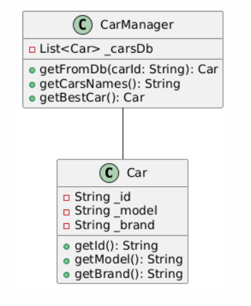
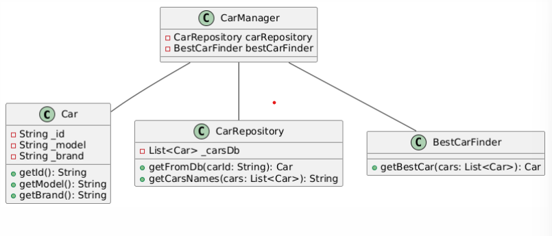
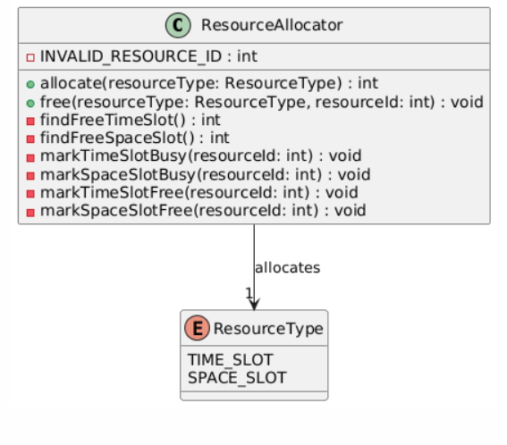
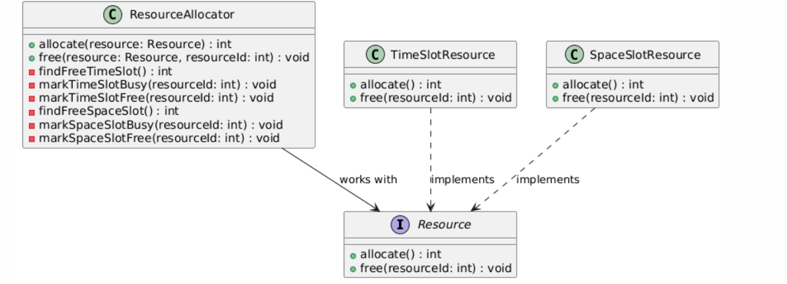
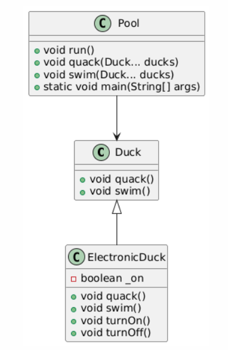
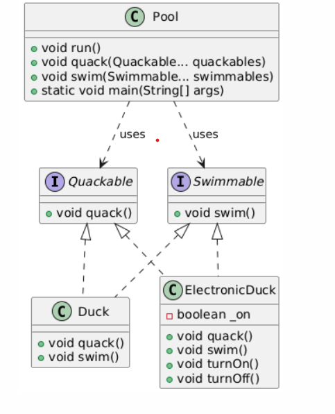
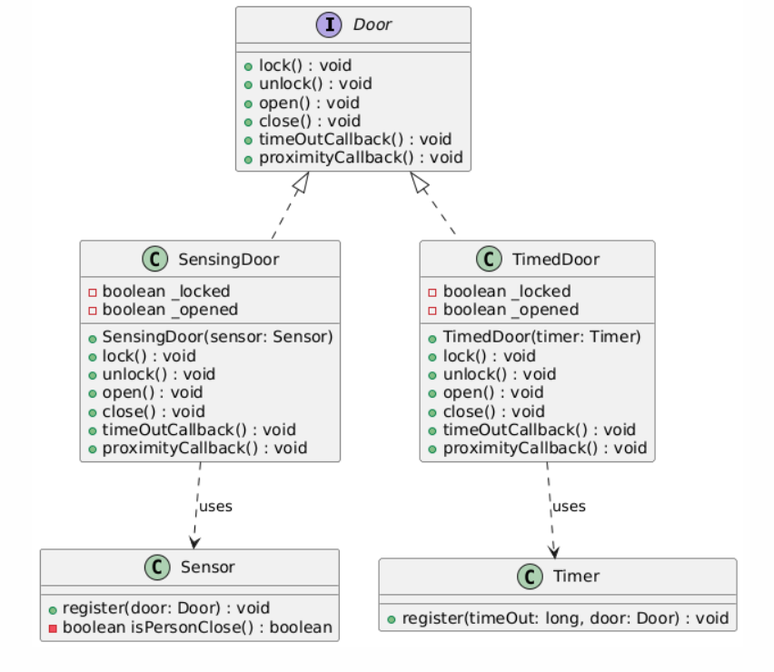
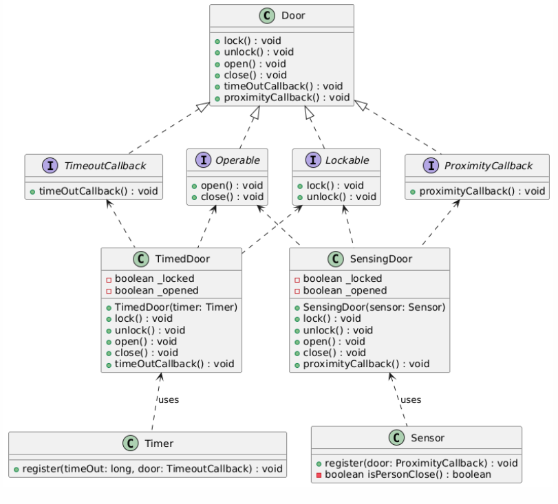
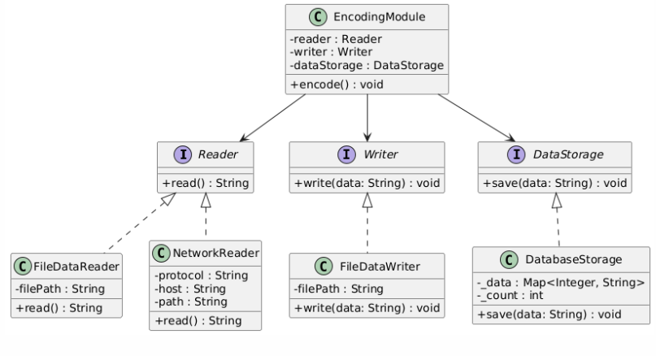

# Atelier SOLID Principles - INSAT

Ce repository contient les solutions et exercices pour l'atelier portant sur les principes SOLID dans le cadre du module d'architecture logicielle. Le but de cet atelier est d'appliquer les principes SOLID à des problèmes existants afin de concevoir des applications plus maintenables, compréhensibles et flexibles.

## Contenu

Le repository est organisé comme suit :
- **SRP** : Principe de responsabilité unique (Single Responsibility Principle)
- **OCP** : Principe ouvert-fermé (Open-Closed Principle)
- **LSP** : Principe de substitution de Liskov (Liskov Substitution Principle)
- **ISP** : Principe de ségrégation des interfaces (Interface Segregation Principle)
- **DIP** : Principe d'inversion des dépendances (Dependency Inversion Principle)

Chaque dossier contient :
1. Le **code après modification** appliquant le principe SOLID.
2. Les **diagrammes UML** (avant et après modification).

---

## Principes SOLID

### 1. SRP - Single Responsibility Principle
- **Problème** : Une classe a plusieurs responsabilités, ce qui la rend difficile à maintenir.
- **Solution** : Diviser les responsabilités en plusieurs classes.
- **Diagrammes UML** :
  - Avant :  
    
  - Après :  
    

### 2. OCP - Open-Closed Principle
- **Problème** : Modifier une classe existante pour ajouter de nouvelles fonctionnalités viole le principe OCP.
- **Solution** : Utiliser des abstractions ou des extensions pour éviter de modifier les classes existantes.
- **Diagrammes UML** :
  - Avant :  
    
  - Après :  
    

### 3. LSP - Liskov Substitution Principle
- **Problème** : Une sous-classe ne peut pas remplacer sa classe parente sans rompre le fonctionnement du système.
- **Solution** : Refactoriser les classes pour respecter le contrat de la classe parente.
- **Diagrammes UML** :
  - Avant :  
    
  - Après :  
    

### 4. ISP - Interface Segregation Principle
- **Problème** : Une interface unique impose des méthodes inutilisées aux classes qui l’implémentent.
- **Solution** : Diviser les interfaces en interfaces plus spécifiques.
- **Diagrammes UML** :
  - Avant :  
    
  - Après :  
    

### 5. DIP - Dependency Inversion Principle
- **Problème** : Les classes dépendent directement de classes concrètes plutôt que d'abstractions.
- **Solution** : Introduire des interfaces ou des abstractions pour inverser les dépendances.
- **Diagrammes UML** :
  - Avant :  
    
  - Après :  
    

---

## Réalisé par

- **Ahmed Cherif**
- **Oussama Ziada**
- **Achraf Triki**
